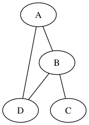
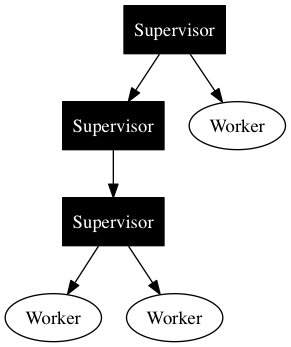

[](https://travis-ci.org/aussiegeek/dotex) [](http://inch-ci.org/github/aussiegeek/dotex)

# Dotex

Generate [Graphviz](http://www.graphviz.org) graphs from Elixir

## Examples

### Simple

```
alias Dotex.{Graph, Node}
a = Node.new("A")
b = Node.new("B")
c = Node.new("C")
d = Node.new("D")

Graph.new(type: "graph")
|> Graph.add_node(a)
|> Graph.add_node(b)
|> Graph.add_connection(a, [b, d])
|> Graph.add_connection(b, c)
|> Graph.add_connection(b, d)
|> Dotex.write_graph("png", "simple.png")
```



### Supervision Tree

```
supervisor_attrs = [label: "Supervisor", shape: "box", fillcolor: "black", fontcolor: "white", style: "filled"]
a = Node.new("A", supervisor_attrs)
b = Node.new("B", supervisor_attrs)
c = Node.new("C", label: "Worker")
d = Node.new("D", supervisor_attrs)
e = Node.new("E", label: "Worker")
f = Node.new("F", label: "Worker")

Graph.new(type: "digraph")
|> Graph.add_node(a)
|> Graph.add_node(b)
|> Graph.add_node(c)
|> Graph.add_node(d)
|> Graph.add_node(e)
|> Graph.add_node(f)
|> Graph.add_connection(a, [b, c])
|> Graph.add_connection(b, d)
|> Graph.add_connection(d, [e, f])
|> Dotex.write_graph("png", "supervision_tree.png")
```


